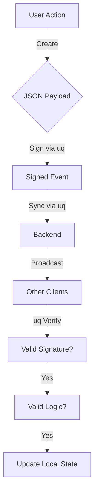

# Democratic Tier (dt) Architecture

**Democratic Tier** is a specialized application for democratic collaboration and voting, built on top of the **UniQue (uq)** protocol.

It leverages `uq` for identity management, cryptographic event signing, and synchronization, focusing solely on the governance logic and user experience.

## Relationship with UniQue

*   **Core Protocol**: [UniQue (uq)](https://github.com/krinistof/uq) handles the "How" (networking, storage, crypto).
*   **Application**: `dt` handles the "What" (votes, tier lists, songs).

## Components

### 1. Identity & State
*   **Identity**: Users are identified by Ed25519 Public Keys (managed by `uq`).
*   **State Management**: `dt` defines the `Reducer` that transforms a stream of `uq` events into the application state (e.g., a calculated Tier List).

### 2. Event Schema (The "Blob")
While `uq` treats payloads as opaque, `dt` defines specific JSON schemas inside those payloads:

*   **Manifesto**: The genesis event defining the group's purpose.
*   **Post**: A proposal or content item (e.g., a Song).
*   **Vote**: A score assigned to a Post.

### 3. Verification Logic
`dt` adds a layer of semantic verification on top of `uq`'s cryptographic verification:
*   *Is the author in the whitelist?*
*   *Is the vote value within valid bounds (0-10)?*
*   *Does the referenced Post exist?*

## Data Flow

