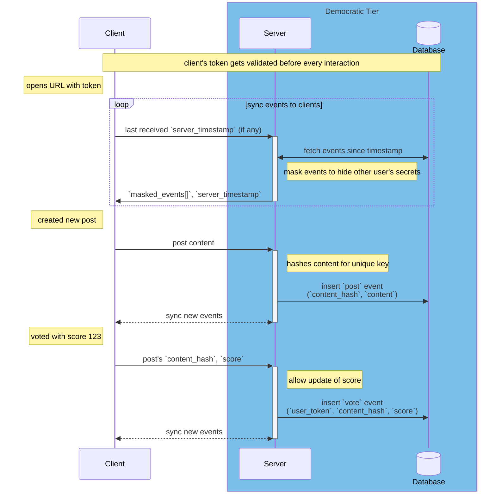
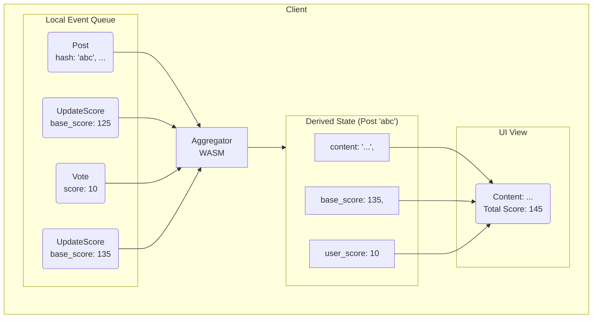

# Sequence of events between server and client

```mermaid
sequenceDiagram
    participant Client
    box rgba(31, 161, 250, .5) Democratic Tier
        participant Server
        participant Database@{type: "database"}
    end


    Note over Client,Database: client's token gets validated before every interaction
    Note left of Client: opens URL with token
    
    loop sync events to clients
        Client->>+Server: last received `server_timestamp` (if any)
        Server<<->>Database: fetch events since timestamp
        Note right of Server: mask events to hide other user's secrets
        Server->>-Client: `masked_events[]`, `server_timestamp`
    end


    Note left of Client: created new post

    Client->>+Server: post content
    Note right of Server: hashes content for unique key
    Server->>Database: insert `post` event<br>(`content_hash`, `content`)
    Server<<-->>-Client: sync new events


    Note left of Client: voted with score 123
    
    Client->>+Server: post's `content_hash`, `score`
    Note right of Server: allow update of score
    Server->>Database: insert `vote` event<br>(`user_token`, `content_hash`, `score`)
    Server<<-->>-Client: sync new events
```

# From events to rendering

```mermaid
graph TD
     subgraph "Client"
         subgraph "Local Event Queue"
             E1(Post <br> hash: 'abc', ...)
             E2(UpdateScore <br> base_score: 125)
             E3(Vote <br> score: 10)
             E4(UpdateScore <br> base_score: 135)
         end

         A[Aggregator <br> WASM]

         subgraph State ["Derived State (Post 'abc')"]
             S1["content: '...'",]
             S2["base_score: 135",]
             S3["user_score: 10"]
         end

         subgraph "UI View"
            UI("Content: ...<br>Total Score: 145")
         end
     end

     E1 --> A
     E2 --> A
     E3 --> A
     E4 --> A

     A --> State
     S1 --> UI
     S2 --> UI
     S3 --> UI
```
