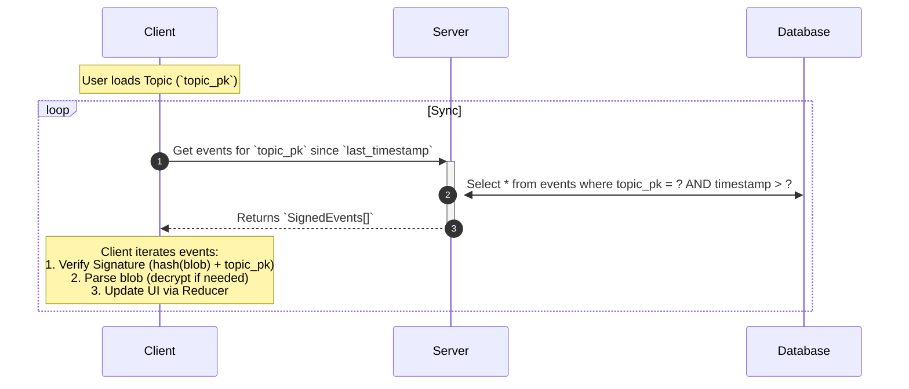
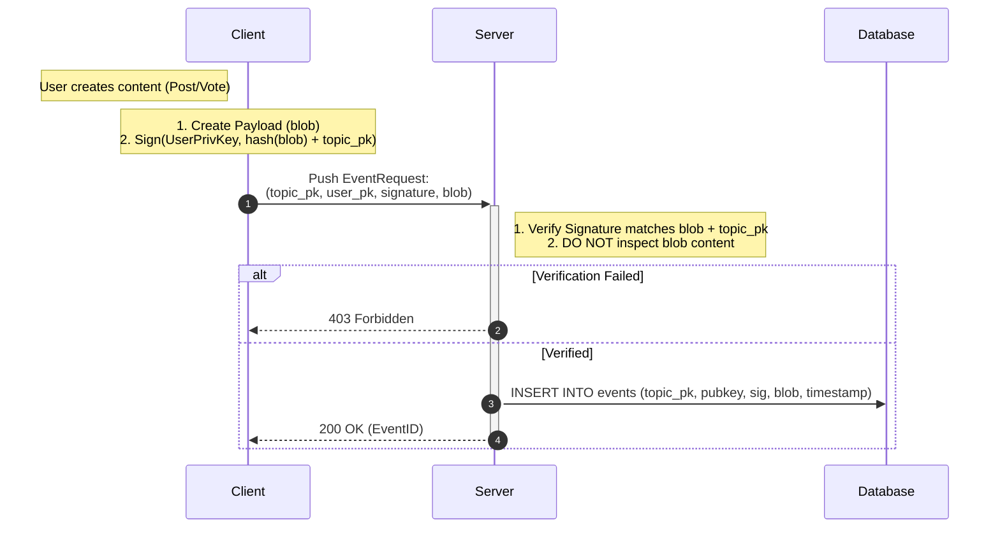
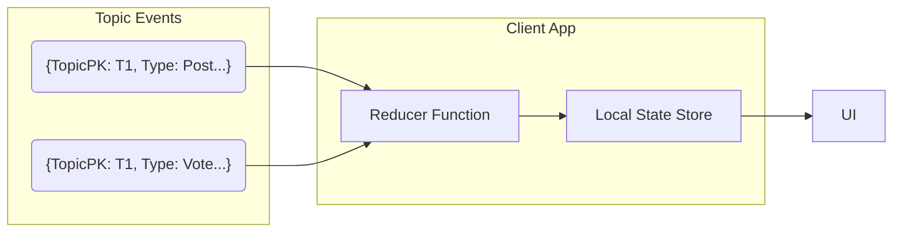

# UniQue (uq) Architecture

The project is structured as a monorepo containing the core protocol libraries and the Democratic Tier application. The architecture separates the core synchronization logic (`uq`) from the specific application implementation.

## Components

### 1. Core Library (`crates/uq`)
-   **Role**: Core Rust library handling logic, storage, and cryptography.
-   **Functionality**: Implements the `Sync` protocol for agnostic event synchronization.
-   **Identity**: Manages identity and verification.

### 2. Server (`crates/uq-server`)
-   **Role**: Standalone server binary.
-   **Stack**: ConnectRPC / Axum.
-   **Features**:
    -   Exposes `SyncService` for clients to fetch/push events.
    -   Integrates `collect_log` for generic client telemetry.
    -   Configurable SQLite storage.

### 3. Client Library (`packages/uq-client`)
-   **Role**: TypeScript client library.
-   **Functionality**:
    -   ConnectRPC client generation.
    -   Cryptography (Key generation, Signing).
    -   State management helper ("Reducer" pattern).
    -   Built-in error reporting.

## Protocol & Cryptography

The protocol uses **Asymmetric Topics**, meaning all topic members have access to the shared asymmetric key, which they use to encrypt events.

### Data Model
Events are cryptographically bound to a Topic.

-   **Topic**: Identified by a unique Public Key (`topic_pk`).
-   **Event Structure**:
    -   `topic_pk`: The identifier of the topic.
    -   `blob`: The opaque data payload (handled by upper layers).
    -   `sig`: Signature verifying the event.

### Verification
To ensure integrity and prevent replay attacks across topics, the signature verification enforces:

`Verify(user_pk, signature, hash(blob) + topic_pk)`

## Sequence of Events

### Client-Server Sync

### Event Publication

### Data Flow (Reducer Pattern)

