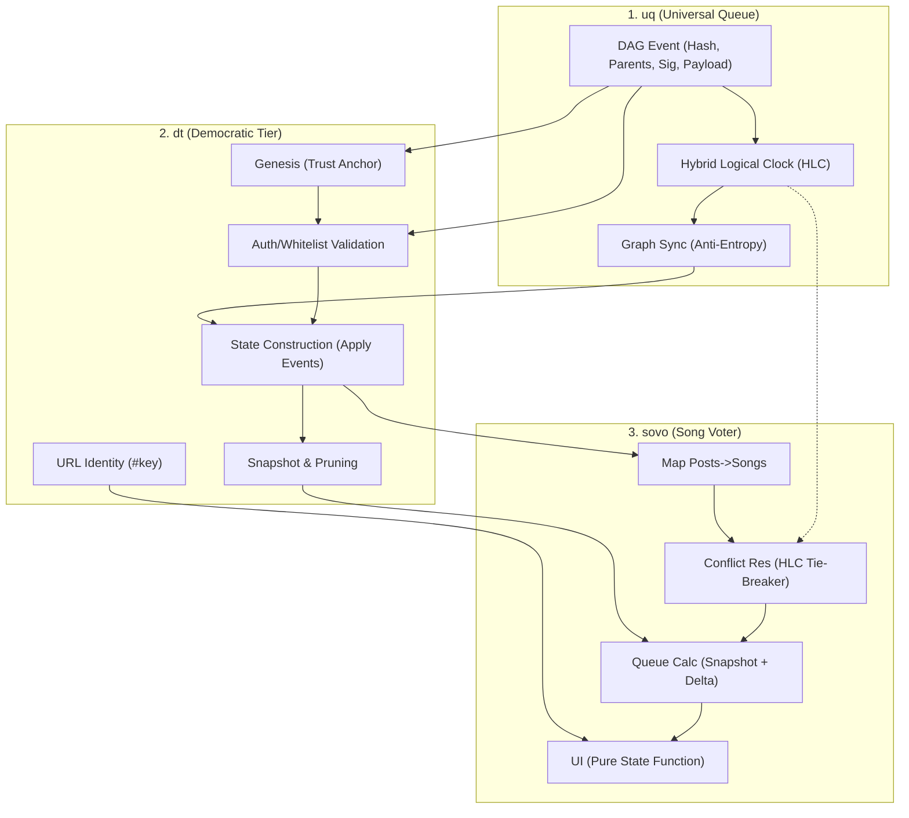

# dt (Democratic Tier) - Development Plan

## Overview

The architecture is layered to provide a generic, verifiable, and decentralized foundation (`uq`), upon which a democratic tier list is built (`dt`), and finally, a specialized music voting application (`sovo`) leverages these primitives.

1.  **uq (universal queue):** The generic, decentralized core protocol. Handles **DAG-based event ordering**, **Hybrid Logical Clocks (HLC)**, and **cryptographic verification**. It treats payloads as opaque blobs (JSON/Protobuf) for privacy and flexibility.
2.  **dt (democratic tier):** A verifiable, flat role system for anonimyzed democratic tier list collaboration. It defines **Whitelist** , **Identity** (URL-based), and **Snapshotting** (managing state size).
3.  **sovo (song voter):** The specific application layer. It adds **Music Semantics** (Songs, Voting logic) and likely integrates with `ft` (later) for media.

**Key Architectural Shift:**
*   **No Client-Side Database:** State is managed in-memory using small buffers of events between snapshots. Outdated events are pruned.
*   **Opaque Payloads:** UQ doesn't know the content. Content is JSON (or Proto later) blobs, potentially encrypted.

---

## 1. UQ Tasks (Core Protocol & DAG)
*The immutable, verifiable log of events.*

### DAG & Event Structure
- [ ] **Event Definition:**
    - Structure: `Hash | Parents[] | Author_PK | Signature | HLC_Timestamp | Payload_Blob`.
    - **DAG Validation:** Ensure `Parents[]` exist and are causally older (HLC check).
- [ ] **Hybrid Logical Clock (HLC):**
    - Implement `HLC` struct: `(wall_time, logical_counter)`.
    - Rule: `Event.hlc = max(SystemTime, max(Parents.hlc) + 1)`.
    - **Advantage:** deterministically orders events without central time authority, resolving concurrency.
- [ ] **Graph Sync (The "Anti-Entropy" Protocol):**
    - **Request:** "I have heads `[H1, H2]`. Give me what I miss."
    - **Response:** "Here is the subgraph you are missing." (Topological sort).
    - **Dependency Resolution:** If a client receives event `E` but misses parent `P`, it explicitly requests `P`.
    - **Advantage:** Sync is efficient and self-healing; no "holes" in the state.

---

## 2. dt Tasks (Trust, State & Identity)
*The governance layer. "Who is allowed to speak?"*

### Trust & Identity
- [ ] **Trust Anchor (Event #0):**
    - The first event in a DAG (`Manifesto`) contains the `Whitelist`, and other metadata.
    - **Validation:** Every new event must trace its ancestry back to Manifesto and prove its author is authorized.
- [ ] **URL Identity:**
    - `#key=<private_key>`: Key never touches backend.
    - Identity derivation: `Pub = derive(Priv)`.
- [ ] **Snapshotting & Pruning:**
    - **State Construction:** `State_N = Apply(State_0, Events_0_to_N)`.
    - **Snapshotting:** Periodically serialize `State_N` (e.g., "Current Whitelist + Active Topics").
    - **Pruning:** Delete events older than Snapshot `N-1`.
    - **Advantage:** Client only holds `Current Snapshot + Recent Delta Buffer`. No heavy DB needed.

---

## 3. SoVo Tasks (Application Layer)
*The music voting logic built on uq.*

### Domain Logic
- [ ] **Vote Semantics:**
    - Map dt "Posts" to "Songs".
    - Use votes to determine current favourite for next song.
    - **Conflict Resolution:** If DAG forks (concurrent votes), HLC + Deterministic Tie-Breaker decides final order.
- [ ] **Queue Calculation:**
    - `CalculateQueue(Snapshot, DeltaBuffer)` -> Ordered List of Songs.
    - **Advantage:** UI is a pure function of the DAG state.

---

## 4. Infrastructure & Testing

### Testing
- [ ] **Regression Benchmarking:** Implement regression benchmarking to prevent merging slower implementations. Compare timed debug logs of all tests on both commits (PR vs Base).

## Dependency Graph

